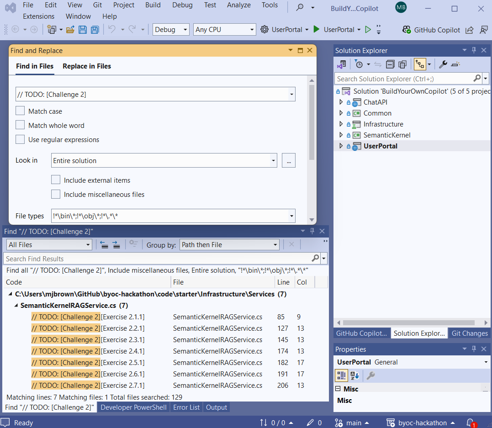

# Build Your Own Copilot with Azure Cosmos DB - Hackathon

Welcome to the Build Your Own Copilot with Azure Cosmos DB hackathon!

## Prerequisites

The following prerequisites are **required** to participate and successfully complete this hackathon.

- Paid Azure Subscription (with **subscription owner** permissions).
- Subscription access to Azure OpenAI service.
- .NET 8 SDK [Install for Windows, Mac, Linux](https://dotnet.microsoft.com/download/dotnet/8.0)
- Docker Desktop - for either [Windows](https://docs.docker.com/desktop/install/windows-install/), [Mac](https://docs.docker.com/desktop/install/mac-install/), [Linux](https://docs.docker.com/desktop/install/linux/)
- AZD [installation instructions](https://learn.microsoft.com/azure/developer/azure-developer-cli/install-azd)
- Azure CLI ([v2.64.0 or greater](https://docs.microsoft.com/cli/azure/install-azure-cli))
- Cross-platform (not Windows) PowerShell ([7.0 or greater](https://learn.microsoft.com/powershell/scripting/install/installing-powershell))
- Visual Studio 2022 [download Free Community version](https://visualstudio.microsoft.com/vs/community/)


> [!NOTE]
>  Free Azure Trial does not have sufficient quota for Azure OpenAI to run this hackathon successfully and cannot be used.

> [!NOTE]
> Installation requires the choice of an Azure Region. Make sure to set region you select which is used in the `<location>` value below supports Azure OpenAI services. See [Azure OpenAI service regions](https://azure.microsoft.com/explore/global-infrastructure/products-by-region/?products=cognitive-services&regions=all) for more information.

> [!NOTE]
> This hackathon requires quota for Azure OpenAI models. To avoid capacity or quota issues, it is recommended before arriving for the hackathon, you deploy both `GPT-4o` and `text-embedding-3-large` models with **at least 100K token capacity** into the subscription you will use for this hackathon. You may delete these models after creating them. This step is to ensure your subscription has sufficient capacity. If it does not, see [How to increase Azure OpenAI quotas and limits](https://learn.microsoft.com/azure/ai-services/openai/quotas-limits#how-to-request-increases-to-the-default-quotas-and-limits)

## Introduction

This hackathon is designed to help you expand your knowledge about the Generative AI patterns used in the **Build Your Own Copilot with Azure Cosmos DB** solution accelerator. The solution accelerator demonstrates how to design and implement a Generative AI solution that incorporates Azure Cosmos DB with Azure OpenAI Service along with other key Azure services, to build an AI assistant user interface.

The hackathon consists of six challenges as follows:

Challenge number | Challenge code | Description
--- | --- | ---
1 | `[Challenge 1]` | Deploy the solution accelerator to your Azure subscription and explore the solution architecture.
2 | `[Challenge 2]` | Learn about the basics of Semantic Kernel, a Large Language Model (LLM) orchestrator that powers the solution accelerator.
3 | `[Challenge 3]` | Learn about intercepting and using key assets from Semantic Kernel's inner workings - prompt and function calling data.
4 | `[Challenge 4]` | Learn how prompts are used in the solution accelerator and experiment with changes to the prompts.
5 | `[Challenge 5]` | Learn about the inner workings and applications of semantic caching in the solution accelerator.
6 | `[Challenge 6]` | Learn about implementing system commands based on user input in the solution accelerator.

> [!IMPORTANT]
> We recommend that you complete the challenges in the order they are presented. The challenges are designed to build on each other, and completing them in order will help you understand the solution accelerator better.

Except for Challenge 1, each challenge will have a set of coding tasks that you need to complete. This repo provides you with the starter project (under the `code/starter` folder).

## Starting the Hackathon

To get started you need to clone this repository to your local machine. This will provide you with the starter solution you will use througout the day. You can do this by running the following command in your terminal or command prompt:

```cmd
git clone https://github.com/solliancenet/byoc-hackathon <your_folder_name>
```


## Challenge 1: Deploy the solution accelerator to your Azure subscription and explore the solution architecture

> [!IMPORTANT]
> Before you proceeed, make sure you review the [Prerequisites](#prerequisites) list above and you install them.

This challenge is about deploying the services for the underlying solution accelerator that is the basis for what you will be building throughout this hackathon. The main repository for the solution accelerator is located here: [Build Your Own Copilot with Azure Cosmos DB](https://github.com/Azure/BuildYourOwnCopilot). 

To get started you must deploy all of the Azure Services for the soluion accelerator. The solution accelerator contains the deployment necessary to run this hackathon. It must be downloaded locally first and then the deployment run from your local machine. Begin by cloning this repository into a new folder.

```cmd
git clone https://github.com/Azure/buildyourowncopilot <your_folder_name>
```

Next, deploy the solution accelerator to your Azure subscription by following the instructions in the [Deployment Guide](https://github.com/Azure/BuildYourOwnCopilot/blob/main/docs/deployment.md#deploy-with-azure-container-apps).

> [!NOTE]
> For the purpose of this hackathon, we recommend that you choose the Azure Container Apps (ACA) option which is the quickest to deploy. See the instructions for [ACA Deployment](https://github.com/Azure/BuildYourOwnCopilot/blob/main/docs/deployment.md#deploy-with-azure-container-apps)

The deployment will take approximately 10-15 minutes. During that time, complete the following tasks:

- Read the information in the [Readme](https://github.com/Azure/BuildYourOwnCopilot/blob/main/README.md) of the solution accelerator repository.
- Read and bookmark the [Key Concepts](https://github.com/Azure/BuildYourOwnCopilot/blob/main/docs/concepts.md) document to understand the key concepts of the solution accelerator. You wil likely return to this document throughout the hackathon to revisit some of the concepts related to each challenge.

Once the deployment is complete, follow the steps in the [Quickstart section](https://github.com/Azure/BuildYourOwnCopilot/blob/main/docs/quickstart.md) to explore the solution accelerator.

### Setup local debugging

Once the solution accelerator has been deployed you can run and debug it locally by completing these instructions. [Run locally and debug](https://github.com/Azure/BuildYourOwnCopilot/blob/main/docs/runlocal.md).

Once you complete the steps above for running locally, take these artifacts and copy them to the starter project so when the hackathon is complete you can run and debug this as well.

> [!NOTE]
> As you might have noticed already, the solution accelerator repository is a public repository. Since this hackathon is based on the solution accelerator, the full set of solutions for the challenges and their exercises are easibly accessible in the solution accelerator repository. Copying and pasting them allows one to complete the hackathon in probably less than a half hour. That would completely defeat the purpose of this exercise which is to produce the solutions on your own, by understanding the inner workings of the solution accelerator and the technologies it is built upon. This is why we strongly encourage you to try to solve the challenges on your own first. If you get stuck, you can always refer to the solution accelerator repository for guidance, but that should be your last resort.

## Finding the Coding Challenges

The remainder of this hackathon will be spent learning concepts and implementing them in Visual Studio writing code. 

For each challenge, you can easily find the code snippets that you need to modify or add by searching for the challenge code in the code files. For example, to identify the code snippets for Challenge 2, search for `[Challenge 2]` in the code files. 

In Visual Studio 2022, you can use the `Edit -> Find and Replace -> Find in Files` menu option of the `Ctrl + Shift + F` keyboard command to search for the challenge code. The result of the search will return multiple locations, each labeled as `// TODO: [Challenge X][Exercise X.E.T]` where `X` is the challenge number, `E` is the exercise number, and `T` is the task number.



> [!IMPORTANT]
> Within each challenge, we also recommend that you complete the exercises in the order they are presented. The exercises are designed to build on each other, and completing them in order will help you understand the solution accelerator better. Make sure you read the hints added as code comments to help you complete the tasks.

For some of the challenges we are also providing some open-ended exercises which do not have a specific solution. These exercises are designed to help you think about the solution accelerator and its components in a more creative way. We encourage you to complete these exercises at the end of the hackathon, after you have successfully completed all the challenges and their exercises.

For each challenge the recommended order of operations is the following:

1. Identify all the exercises for the challenge and read the hints provided in the code comments.
2. Attempt to tackle the exercises in the order they are presented. For each exercise, check the list of suggested readings to help you understand the concepts you need to apply (those lists are provided below for each challenge).
3. Take a note of any open-ended exercises and try to complete them at the end of the hackathon.

## Challenge 2: Learn about the basics of Semantic Kernel

This challenge is intended to get you familar with Semantic Kernel that is used extensively to implement this solution. There is no coding in this Challenge. Rather you are asked to read the articles below before going to Visual Studio and searching for the `Challenge 2` items. Here are the suggested readings that will help you address the tasks in the challenge:

- [Understanding the kernel](https://learn.microsoft.com/semantic-kernel/concepts/kernel?pivots=programming-language-csharp)
- [What is a Plugin?](https://learn.microsoft.com/semantic-kernel/concepts/plugins/?pivots=programming-language-csharp)
- [How to use function calling with Azure OpenAI Service](https://learn.microsoft.com/azure/ai-services/openai/how-to/function-calling)
- [What is a Planner?](https://learn.microsoft.com/semantic-kernel/concepts/planning?pivots=programming-language-csharp)
- [Embeddings](https://platform.openai.com/docs/guides/embeddings/use-cases)
- [Build Your Own Copilot with Azure Cosmos DB - Key Concepts](https://github.com/Azure/BuildYourOwnCopilot/blob/main/docs/concepts.md)

You may now go to the starter solution in Visual Studio and complete Challege 2. Locate the exercises by searching for `//TODO: [Challenge 2]` as shown in [Finding the Coding Challenges](#finding-the-coding-challenges). Then complete each exercise.

This challenge does not have open-ended exercises.

## Challenge 3: Learn about intercepting and using key assets from Semantic Kernel's inner workings

Before completing this challenge, here are some suggested readings that will help you address the tasks in the challenge:

- [Using Filters in Semantic Kernel](https://devblogs.microsoft.com/semantic-kernel/filters-in-semantic-kernel/)

You may now go to the starter solution in Visual Studio and complete Challege 3. Locate the exercises by searching for `//TODO: [Challenge 3]` as shown in [Finding the Coding Challenges](#finding-the-coding-challenges). Then complete each exercise.

Open-ended exercises (recommended to be completed at the end of the hackathon):
- Exercise `3.3.1` - implement your own `IFunctionInvocationFilter`.

## Challenge 4: Learn how prompts are used in the solution accelerator

Here are some suggested readings that will help you address the tasks in the challenge:

- [Prompt injection article from the Open Worldwide Application Security Project (OWASP)](https://genai.owasp.org/llmrisk/llm01-prompt-injection/) to understand the core principles of prompt injection vulnerabilities.

You may now go to the starter solution in Visual Studio and complete Challege 4. Locate the exercises by searching for `//TODO: [Challenge 4]` as shown in [Finding the Coding Challenges](#finding-the-coding-challenges). Then complete each exercise.


Open-ended exercises (recommended to be completed at the end of the hackathon):
- Implement an `ISystemPromptService` class that retrieves the system prompt from a different source (e.g., Azure Cosmos DB, GitHub, etc.) and use it in the solution.

## Challenge 5: Learn about the inner workings and applications of semantic caching

Here are some suggested readings that will help you address the tasks in the challenge:
- [Build Your Own Copilot with Azure Cosmos DB - Key Concepts](https://github.com/Azure/BuildYourOwnCopilot/blob/main/docs/concepts.md)

You may now go to the starter solution in Visual Studio and complete Challege 5. Locate the exercises by searching for `//TODO: [Challenge 5]` as shown in [Finding the Coding Challenges](#finding-the-coding-challenges). Then complete each exercise.

This challenge does not have open-ended exercises.

## Challenge 6: Learn about implementing system commands based on user input

Here are some suggested readings that will help you address the tasks in the challenge:
- [Build Your Own Copilot with Azure Cosmos DB - Key Concepts](https://github.com/Azure/BuildYourOwnCopilot/blob/main/docs/concepts.md)

You may now go to the starter solution in Visual Studio and complete Challege 6. Locate the exercises by searching for `//TODO: [Challenge 6]` as shown in [Finding the Coding Challenges](#finding-the-coding-challenges). Then complete each exercise.

Open-ended exercises (recommended to be completed at the end of the hackathon):
- Create a new system command and plug it into the system.

## Conclusion:

We hope you enjoyed completing this hackathon. If you did not complete it, we encourage you to continue and complete all of the challenges as well as the open-ended exercises. The knowledge you will acquire will provide immense value in developing and deploying your own solution into production.